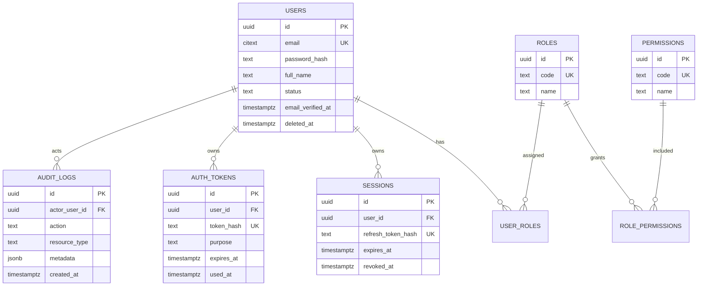

# Database Schema

Version: Phase 3 foundation

## Overview

PostgreSQL is the source of truth. Schema changes are applied with `golang-migrate`. Query access uses `sqlc` + `pgx`.

Local Docker Compose publishes Postgres on host port **5433** (container 5432) to avoid conflicts with native PostgreSQL installs.

## Tooling

From repository root:

```bash
# Apply migrations
pnpm db:migrate

# Rollback one migration
node scripts/db-migrate.mjs down 1

# Generate sqlc code
pnpm --filter @7oz/backend sqlc:generate

# Seed super admin (requires migrations applied)
pnpm --filter @7oz/backend db:seed
```

Default seed admin (development only):

- Email: `admin@7oz.local`
- Password: `ChangeMeNow!123`

The seed is idempotent: if the admin already exists, it still ensures the `super_admin` role is assigned.

Override with `SEED_ADMIN_EMAIL`, `SEED_ADMIN_PASSWORD`, `SEED_ADMIN_NAME`.

## Tables

| Table | Purpose | Soft delete |
| --- | --- | --- |
| `roles` | RBAC roles | No |
| `permissions` | RBAC permissions | No |
| `role_permissions` | Role ↔ permission | No |
| `users` | Authenticated accounts | Yes (`deleted_at`) |
| `user_roles` | User ↔ role | No |
| `sessions` | Refresh-token sessions | No (`revoked_at`) |
| `auth_tokens` | Email verify / password reset | No (`used_at`) |
| `audit_logs` | Immutable audit trail | No |
| `media_folders` | Media library folders | Yes (`deleted_at`) |
| `media_assets` | Uploaded media metadata | Yes (`deleted_at`) |
| `cms_pages` | CMS pages (homepage, about, …) | Yes (`deleted_at`) |
| `cms_sections` | Page sections | Yes (`deleted_at`) |
| `cms_contents` | Draft section payloads (JSONB) | No |
| `cms_versions` | Published page snapshots | No |
| `reservation_settings` | Slot/capacity/hours configuration | No |
| `cafe_tables` | Physical tables and seat capacity | Yes (`deleted_at`) |
| `reservation_closed_days` | Full-day holiday / temporary closures | No |
| `reservations` | Guest/customer bookings | Yes (`deleted_at`) |
| `reservation_histories` | Reservation status audit trail | No |
| `contact_messages` | Public contact form submissions | No |
| `membership_levels` | Configurable membership tiers | Yes (`deleted_at`) |
| `membership_benefits` | Tier and global benefits | Yes (`deleted_at`) |
| `memberships` | Customer membership profiles | Yes (`deleted_at`) |
| `membership_histories` | Membership level/status history | No |
| `loyalty_settings` | Loyalty earning/expiration configuration | No |
| `loyalty_accounts` | Customer loyalty balances | Yes (`deleted_at`) |
| `loyalty_transactions` | Immutable loyalty ledger | No |
| `loyalty_rewards` | Redeemable rewards catalog | Yes (`deleted_at`) |
| `loyalty_redemptions` | Reward redemption records | No |
| `loyalty_campaigns` | Point campaigns and bonuses | Yes (`deleted_at`) |

## MVP Roles

- `customer`
- `admin`
- `super_admin`

Admin contact inbox uses permission `contact.manage` (granted to Admin and Super Admin).

## ER Diagram



## Migration Files

Located in `apps/backend/database/migrations/`.

sqlc reads the consolidated schema from `apps/backend/database/schema.sql`.
Keep `schema.sql` synchronized whenever migrations change.
